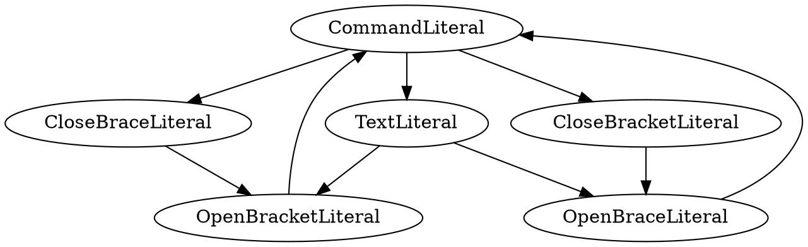

# OLeX


The document is prowered by Vditor!

## Design

 is a pluggable TeX transformer, the architecture as followed:

```mindmap
- OLeX
  - Before Analysis
    - Preprocessor
      - CRLF Handler
      - Pre Formatter
      - Mounter
  - Analyzing
    - Analyzer
      - Tokenizer
      - Lexical Analyzer
      - Grammatical Analyzer
      - Semantic Analyzer (desperated)
      - Return Abstract Syntax Tree
  - Rendering
    - Renderer
      - Walk through AST
      - Match mounted renderer unit
      - Return HTML
  - After Rendering
    - Callback Promise
  - Shortcuts
```

## State Machine


